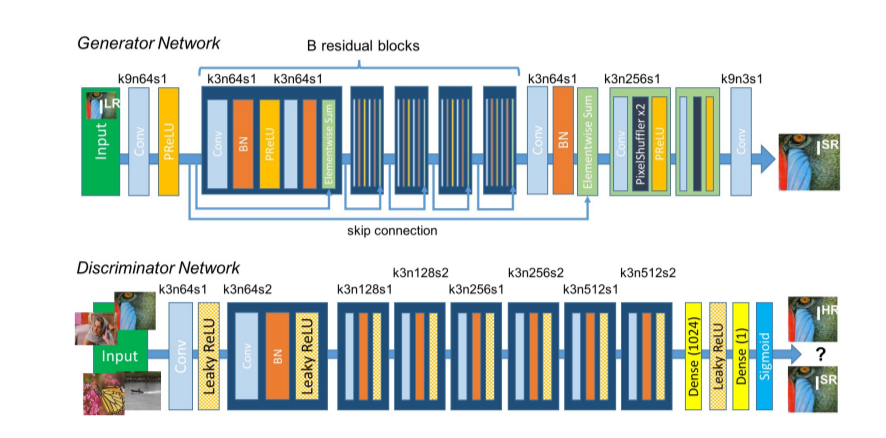

# SRGAN
A project dedicated to the study of the architecture of a SRGAN. 
A detailed description of the model's intricacies can be found in the article [Photo-Realistic Single Image Super-Resolution Using a Generative Adversarial
Network](https://arxiv.org/pdf/1609.04802#page=10&zoom=100,66,644) <br>
Optimization: [](https://colab.research.google.com/drive/1VQPwycLFqisijA5ynduMg3s9-EghLvTk?usp=sharing)

## Setup 
It is required to have:
- Anaconda

Specific requirements for each method are described in its section. 
To install SRGAN please run the following commands:
  ```shell script
conda install --yes -c pytorch pytorch=1.7.1 torchvision cudatoolkit=<CUDA_VERSION>
pip install git+https://github.com/nworkv/SRGAN.git
```
## Architecture
<br>  <br>
The architecture was taken from the article. The difference from the article is a simplified generator loss function(vgg19->vgg16).
```
class GeneratorLoss(nn.Module):
  def __init__(self):
    super(GeneratorLoss, self).__init__()
    vgg = vgg16(weights='IMAGENET1K_V1')
    loss_network = nn.Sequential(*list(vgg.features)[:29]).eval()
    for param in loss_network.parameters():
        param.requires_grad = False

    #Perceptual Loss
    self.loss_network = loss_network
    self.per_loss = nn.MSELoss()
    #Adversarial loss
    self.adv_loss = nn.BCELoss()
    #L1
    self.l1_loss = nn.L1Loss()

  def forward(self, pred_image, target_image, pred, target):
    loss1 = self.per_loss(self.loss_network(pred_image), self.loss_network(target_image))
    loss2 = self.adv_loss(pred, target)
    loss3 = self.l1_loss(pred_image, target_image)
    return 0.006 * loss1 + 0.001 * loss2 + 0.02 * loss3
```
<br> Discriminator loss does not differ <br>
```
class DiscriminatorLoss(nn.Module):
  def __init__(self):
    super(DiscriminatorLoss, self).__init__()
    self.loss = nn.BCELoss()
  def forward(self, pred, target):
    return 10 * self.loss(pred, target)
```
Тhe training took place in two stages.
- Training generator with only MSE loss or L1 loss.
- Training generator with GeneratorLoss(presented above).

